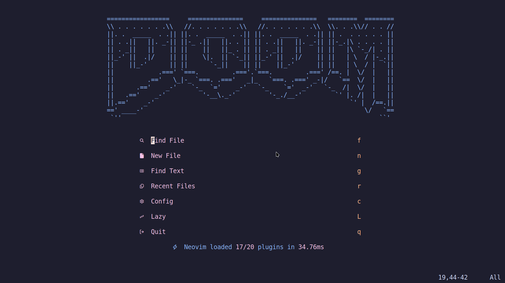
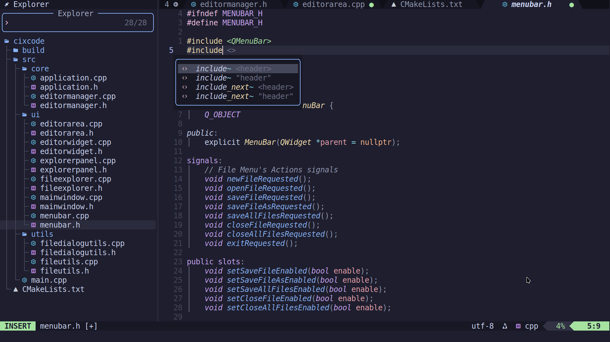

# My Neovim Configuration

This is my personal Neovim setup, tailored for speed, productivity, and better file navigation.
It includes keymaps, pickers, LSP integrations, and various toggles.

## Screenshots

### Dashboard

### Workspace

## Keymaps

### General
| Key          | Description             | Mode |
|--------------|-------------------------|------|
| `<Esc>`      | Clear search highlights | n    |
| ``<leader>` `` | Save and reload config | n    |
| `H`          | Jump to line start      | n    |
| `L`          | Jump to line end        | n    |
| `n`          | Next search centered    | n    |
| `N`          | Previous search centered| n    |
| `<Esc><Esc>`      | Exit terminal mode      | t    |

### Indent & Paste
| Key | Description                             | Mode |
|-----|-----------------------------------------|------|
| `<` | Indent line left                        | n    |
| `>` | Indent line right                       | n    |
| `<` | Indent selection left and reselect      | v    |
| `>` | Indent selection right and reselect     | v    |
| `p` | Paste after cursor and indent           | n    |
| `p` | Paste over selection and indent         | x    |

### Files & Saving
| Key        | Description              | Mode |
|------------|--------------------------|------|
| `<leader>w`| Save buffer              | n    |
| `<leader>W`| Save all buffers         | n    |
| `<leader>x`| Save and quit window     | n    |
| `<leader>X`| Save and quit all windows| n    |
| `<leader>q`| Quit window              | n    |
| `<leader>Q`| Quit all windows         | n    |
| `<leader>rf`| Rename File             | n    |

### Windows & Splits
| mey        | Description            | Mode |
|------------|------------------------|------|
| `<leader>sj` | Horizontal split     | n    |
| `<leader>sl` | Vertical split       | n    |
| `<C-h>`    | Move to left window    | n    |
| `<C-l>`    | Move to right window   | n    |
| `<C-j>`    | Move to lower window   | n    |
| `<C-k>`    | Move to upper window   | n    |
| `<A-h>`    | Move window far left   | n    |
| `<A-l>`    | Move window far right  | n    |
| `<A-j>`    | Move window to bottom  | n    |
| `<A-k>`    | Move window to top     | n    |
| `<C-Left>` | Resize window narrower | n    |
| `<C-Right>`| Resize window wider    | n    |
| `<C-Down>` | Resize window shorter  | n    |
| `<C-Up>`   | Resize window taller   | n    |

### Buffers & Tabs
| Key        | Description    | Mode |
|------------|----------------|------|
| `<leader>bn` | Next buffer  | n    |
| `<leader>bp` | Prev buffer  | n    |
| `<S-l>`    | Next buffer    | n    |
| `<S-h>`    | Prev buffer    | n    |
| `<leader>bd` | Delete buffer| n    |
| `<leader>tn` | Next tab     | n    |
| `<leader>tp` | Prev tab     | n    |
| `<leader>te` | New tab      | n    |
| `<leader>tc` | Close tab    | n    |

### Search & Pickers (Snacks)
| Key              | Description            | Mode |
|------------------|------------------------|------|
| `<leader><space>`| Smart Find Files       | n    |
| `<leader>n`      | Notification history   | n    |
| `<leader>e`      | File Explorer          | n    |
| `<leader>fb`     | Buffers                | n    |
| `<leader>fc`     | Find Config File       | n    |
| `<leader>ff`     | Find Files             | n    |
| `<leader>fg`     | Find Git Files         | n    |
| `<leader>fp`     | Projects               | n    |
| `<leader>fr`     | Recent                 | n    |

### Git (Snacks)
| Key        | Description       | Mode |
|------------|-------------------|------|
| `<leader>gb` | Git Branches    | n    |
| `<leader>gl` | Git Log         | n    |
| `<leader>gL` | Git Log Line    | n    |
| `<leader>gs` | Git Status      | n    |
| `<leader>gS` | Git Stash       | n    |
| `<leader>gd` | Git Diff Hunks  | n    |
| `<leader>gf` | Git Log File    | n    |

### LSP
| Key        | Description              | Mode |
|------------|--------------------------|------|
| `gd`       | Goto Definition          | n    |
| `gD`       | Goto Declaration         | n    |
| `gr`       | References               | n    |
| `gi`       | Goto Implementation      | n    |
| `gy`       | Goto Type Definition     | n    |
| `<leader>ss` | LSP Symbols            | n    |
| `<leader>sS` | LSP Workspace Symbols  | n    |
| `<leader>ca` | Code Action            | n    |
| `<leader>f`  | Format Buffer          | n    |
| `<leader>rn` | Rename Symbol          | n    |

### Toggles (Snacks)
| Key        | Description              | Mode |
|------------|--------------------------|------|
| `<leader>.` | Toggle Scratch Buffer   | n    |
| `<C-/>`    | Toggle Terminal          | n    |
| `<leader>us`| Toggle Spelling         | n    |
| `<leader>uw`| Toggle Wrap             | n    |
| `<leader>uL`| Toggle Relative Number  | n    |
| `<leader>ud`| Toggle Diagnostics      | n    |
| `<leader>ul`| Toggle Line Number      | n    |
| `<leader>uc`| Toggle Conceal Level    | n    |
| `<leader>uT`| Toggle Treesitter       | n    |
| `<leader>ub`| Toggle Dark Background  | n    |
| `<leader>uh`| Toggle Inlay Hints      | n    |
| `<leader>ug`| Toggle Indent Guides    | n    |
| `<leader>uD`| Toggle Dim              | n    |
