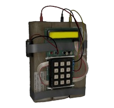

# Bomb Timer Script



A simple countdown timer script for Linux that shows an updating notification via dunstify and plays sounds at the start and finish. The only drawback of this script is that dunst does not support showing multiple notifications simultaneously, so while the script is running, other notifications get overridden.

---

## Requirements

- `dunst` notification daemon
- `pw-play` (PipeWire sound player)
- `bash` shell
---

## Usage

### Start the timer

```bash
./bomb.sh              # Starts a 30-minute countdown (default)

./bomb.sh --time 10s   # Starts a 10-second countdown
./bomb.sh --time 10m   # Starts a 10-minute countdown
./bomb.sh --time 10h   # Starts a 10-hour countdown
```
### Stop the timer
```bash
./bomb.sh --stop   # Stops the currently running timer
```
You can also add this script to `/usr/local/bin/` or something like that, so you can call it from the terminal as bomb or whatever you name it.
